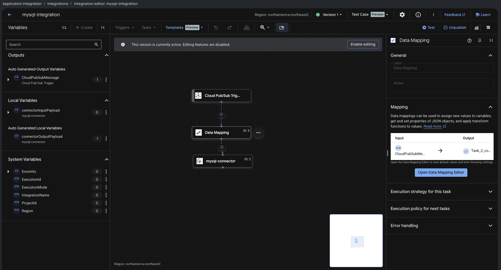
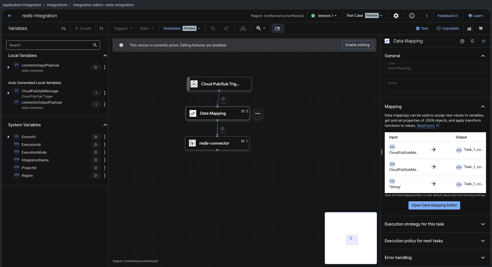
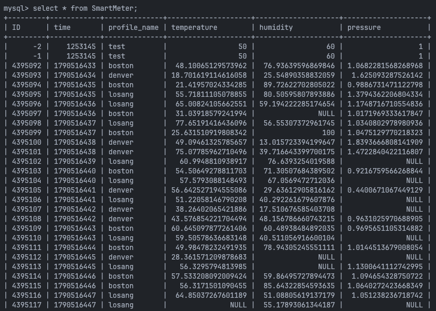
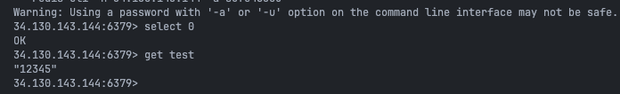

# Milestone 2 Report

### Data Storage and Integration Connectors
This report covers the discussion and design portions of Milestone 2, where we deployed MySQL and Redis on GKE and wired them up to Google Pub/Sub through Integration Connectors sink connectors.

---

## GitHub Repository

The scripts used in the Design section below (`produceImage.py`, `ReceiveImage.py`, and `smartMeter.py`) are available here:

**https://github.com/CrisH2307/SOFE4630U-MS2**

---

## Discussion

### What's the difference between Source and Sink connectors?

The difference comes down to which direction the data is flowing.

A **source connector** pulls data out of an external system and pushes it into the pipeline. For example, it can watch a database for new or changed rows and publish each change as a Pub/Sub message. It originates events from wherever the data already lives and feeds them into the stream.

A **sink connector**, which is what we built in this lab, sits at the other end of the pipeline. It listens to a Pub/Sub topic and writes whatever comes through into a data store. Both connectors we configured, the MySQL connector writing SmartMeter readings into a table and the Redis connector writing the encoded image under a key, are sink connectors. They consume messages and persist them.

In short: a source connector reads from a system and writes to Pub/Sub, while a sink connector reads from Pub/Sub and writes to a system.

### What are the applications of connectors?

Beyond this lab, connectors like these show up anywhere a team needs to move or store data without hand writing the plumbing between two systems every time:

* **Real time analytics and IoT pipelines.** Sensor or device data, like the SmartMeter readings here, gets pushed to a topic and automatically sunk into a database for dashboards or reporting, with no custom consumer code to maintain.
* **Caching layers.** A Redis sink connector can keep a fast, in memory copy of frequently accessed data, such as session data, computed results, or images, so applications don't have to hit a slower system of record on every request.
* **Change Data Capture (CDC).** Source connectors on a production database can stream every insert, update, or delete out to other systems, such as search indexes, warehouses, or replicas, in near real time.
* **System integration and ETL.** Connecting SaaS tools, message queues, and databases together, for example syncing CRM data into a warehouse, without writing and maintaining custom integration code for every pair of systems.
* **Event driven microservices.** Sink connectors let services stay decoupled. A service just publishes an event, and a connector handles getting it into whichever store needs it, so producers never need to know who is consuming.
* **Backup and archiving.** Automatically sinking a stream of events into cheap storage for auditing or replay later.

---

## Design

In Milestone 1 we built a simple producer consumer pipeline: a producer published messages to a Pub/Sub topic, and a consumer subscribed to read them back. For this milestone we added a storage stage in the middle, so the pipeline now looks like this:

```
Producer -> Pub/Sub Topic -> Sink Connector (Application Integration) -> Data Store -> read back by a client
```

The two integrations below both follow that same shape: a Cloud Pub/Sub trigger, a Data Mapping task to reshape the message, and a connector task that writes into the data store.



*The `mysql-integration` flow: Cloud Pub/Sub Trigger to Data Mapping to `mysql-connector`.*



*The `redis-integration` flow: Cloud Pub/Sub Trigger to Data Mapping to `redis-connector`.*

We used both data stores covered in this lab, matched to the shape of the data each pipeline carries.

* **MySQL**, for the SmartMeter readings (`smartMeter.py` to the `smartMeterReadings` topic to the `mysql-connector` to the `SmartMeter` table). Each reading, ID, temperature, humidity, pressure, and timestamp, is structured and numeric, and it's the kind of data we would want to query later, for example "readings where a value exceeds a threshold." A relational table is a natural fit here because it gives us schema enforcement and simple SQL filtering for free.
* **Redis**, for the image transfer (`produceImage.py` to the `Image2Redis` topic to the `redis-connector` to key `image`). An image doesn't need a schema or relational queries. It's a single blob we want to write once and read back as fast as possible by key. Redis's key value model is simpler and lower latency for that access pattern than standing up a table would be.

Splitting the design this way also shows that both connector types share the same trigger stage (Cloud Pub/Sub) and Application Integration setup. Only the destination task (MySQL connector vs. Redis connector) and the data mapping step change. That is really the payoff of using Integration Connectors instead of writing two separate custom consumers: the storage stage is swappable without touching the producer side of the pipeline at all.

### Verifying the results

On the MySQL side, querying the `SmartMeter` table shows the test rows from the integration (IDs -1 and -2) alongside the rows published later by `smartMeter.py`:



On the Redis side, after running the integration and `produceImage.py`, the value can be read straight back from the Redis CLI:



---

## Demonstration Videos

https://drive.google.com/file/d/1dkLAPbgzS9-qUbuMYuXA_-YKWMeNUIAB/view?usp=drive_link
